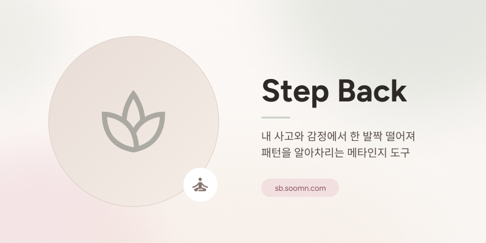
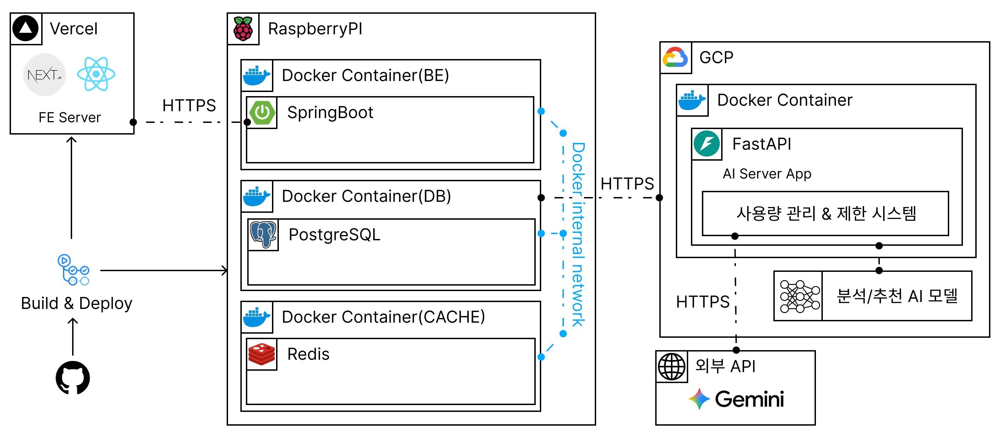

<p align="center">
  
</p>

<p align="center">
  <sub>한 발짝 물러서, 내 마음을 본다 — 사고와 감정의 패턴을 알아차리는 메타인지 도구</sub>
</p>

<p align="center">
  <a href="https://sb.soomn.com"></a>
  &nbsp;
  
  &nbsp;
  
</p>

<p align="center">
  🚀 <a href="https://sb.soomn.com">Live Demo</a> &nbsp;|&nbsp;
  📝 <a href="https://app.notion.com/p/GDG-5-5-Team-1-5e2560204dbc82668fb581d70f657e39?source=copy_link">팀 노션</a> &nbsp;|&nbsp;
  🎨 <a href="https://www.figma.com/design/tkkkJjkuf569wvJCFHwmgu/Design?node-id=0-1&t=3bIgz8MbDDR42QX5-1">Figma</a>
  <br/>
  💻 <a href="https://github.com/GDG-on-Campus-KNU/0-to-product-team-1-fe">Frontend Repo</a> &nbsp;|&nbsp;
  🗄 <a href="https://github.com/GDG-on-Campus-KNU/0-to-product-team-1-be">Backend Repo</a> &nbsp;|&nbsp;
  🤖 <a href="https://github.com/ksjerev17/stepback-ML-GDG-team1-ml-/tree/8f1d80b85f100fd55689f7dcea1746b64f811352">ML Repo</a>
</p>

---

## 📖 프로젝트 소개 (Introduction)

> **"자기계발서를 다 읽을 시간은 없습니다. 그래서 '행동'으로 자기를 발견합니다."**

**Step Back(스텝백)** 은 바쁜 일상 속에서 **하루 한 줄**을 적으면, 그 글에 담긴 사고·감정 패턴을 분석해 **3분짜리 마음 행동(드릴)** 한 가지를 추천하는 **인지·행동 기반 메타인지 도구**입니다.

이 저장소는 **Step Back의 백엔드(Spring Boot)** 입니다. REST API · JWT 인증 · 데이터 모델 · ML 서비스 연동 · 주간/월간 리포트 스케줄링을 담당합니다.

- **개발 기간:** 2026.04.30 ~ 2026.06.25
- **배포 주소:** **https://sb.soomn.com**

<br/>

## 📌 목차

- [핵심 역할](#-핵심-역할-key-responsibilities)
- [기술 스택](#-기술-스택-tech-stack)
- [시스템 아키텍처](#-시스템-아키텍처-architecture)
- [데이터 모델](#-데이터-모델-data-model)
- [API 개요](#-api-개요-api-overview)
- [ML 서비스 연동](#-ml-서비스-연동-ml-integration)
- [안전 설계](#-안전-설계-safety)
- [실행 방법](#-실행-방법-getting-started)
- [프로젝트 구조](#-프로젝트-구조-project-structure)
- [팀 소개](#-팀-소개-team)
- [면책 조항](#-면책-조항-disclaimer)

<br/>

## ⚙️ 핵심 역할 (Key Responsibilities)

| 영역 | 설명 |
| :--- | :--- |
| **인증 / 보안** | JWT 발급·검증, Redis 기반 토큰 블랙리스트, Spring Security |
| **기록(Entry)** | 하루 한 줄 + 컨디션·수면·운동·사교 입력 저장, ML 분석 결과(JSONB) 보관 |
| **드릴 추천** | ML 서버에 라벨링·추천 요청, 오늘의 드릴 조회, 완료/피드백 기록 |
| **리포트** | 주간·월간 리포트 자동 생성(스케줄러), 조회·확인·메모(나의 발견) |
| **캘린더 / 기록 조회** | 월간 캘린더, 일자별 드릴 기록 조회 |
| **베이스라인 / 인사이트** | 사용자 스냅샷 비교, 누적 발견 저장 |
| **운영** | Flyway 마이그레이션, 이메일 발송, 관리자용 쿼터/베이스라인 트리거 |

<br/>

## 🛠 기술 스택 (Tech Stack)

| Category | Stack |
| :--- | :--- |
| **Language** |  |
| **Framework** |     |
| **Database** |  (JSONB) |
| **Migration** |  |
| **Cache / Token Store** |  |
| **Auth** | -000000?logo=jsonwebtokens&logoColor=white) |
| **API Docs** |  |
| **Mail** |  |
| **Build** |  |
| **Container** |  |
| **CI/CD** |  |
| **Deploy** |  |

<br/>

## 🏗 시스템 아키텍처 (Architecture)

<p align="center">
  
</p>

| 레이어 | 구성 | 역할 |
| :--- | :--- | :--- |
| **FE Server** | Next.js · React (Vercel) | 모바일 우선 UI, 캘린더·리포트 화면 |
| **BE (이 저장소)** | Spring Boot (Docker, GCP) | REST API, JWT 인증, 데이터 모델, ML 연동, 리포트 스케줄링 |
| **DB / Cache** | PostgreSQL · Redis (Docker) | 영구 저장(JSONB) · 캐시 · 토큰 블랙리스트 |
| **AI Server** | FastAPI (Docker, GCP) | 13차원 점수화, 드릴 추천, 사용량 관리·제한 |
| **External** | Google Gemini | 점수 산출용 LLM (temperature 0.1 · JSON) |

> 백엔드는 사용자 글을 **직접 LLM에 보내지 않고** ML 서버를 경유하며, 위기 신호·PII는 LLM 호출 전에 차단·마스킹됩니다.

<br/>

## 🗄 데이터 모델 (Data Model)

사용자의 "하루"가 여러 테이블로 분해 저장됩니다. (Flyway `V1`~`V8` 마이그레이션 관리)

| 엔티티 | 테이블 | 핵심 컬럼 |
| :--- | :--- | :--- |
| **User** | `users` | email, displayName, 인증 정보 |
| **Entry** | `entries` | text, `label_result_json`(분석), `recommendation_json`(추천), drillId/category/color, crisisFlag, drillCompleted, helpful, contextJson |
| **ReportWeekly** | `reports_weekly` | weekId, blocksJson, visualizationsJson, isChecked, userMemo(나의 발견) |
| **ReportMonthly** | `reports_monthly` | monthId, blocksJson |
| **Baseline** | `baselines` | snapshotJson, capturedAt |
| **InsightUser** | `insights_user` | discoveryText |

> 분석·추천 결과는 확장성을 위해 **JSONB** 로 통째 저장합니다. 자세한 ERD는 [`be/ERD.md`](./be/ERD.md) 참고.

<br/>

## 🔌 API 개요 (API Overview)

> 전체 명세는 실행 후 Swagger UI(`/swagger-ui.html`)에서 확인할 수 있습니다.

| 도메인 | 메서드 · 경로 | 설명 |
| :--- | :--- | :--- |
| **Auth** | `POST /api/auth/signup`, `POST /api/auth/login` | 회원가입 · 로그인(JWT 발급) |
| **User** | `GET·PATCH·DELETE /users/me` | 내 정보 조회 · 수정 · 탈퇴 |
| **Entry** | `POST /entries` | 하루 기록 생성 → ML 분석·추천 |
| | `PATCH /entries/{id}/feedback` | 드릴 완료/도움 여부 평가 |
| **Drill** | `GET /drills/today` | 오늘의 드릴 조회 |
| **Record** | `GET /records/calendar`, `GET /records/daily/{date}` | 월간 캘린더 · 일자별 기록 |
| **Report** | `GET /reports/weekly`, `GET /reports/weekly/{weekId}` | 주간 리포트 목록 · 상세 |
| | `GET /reports/monthly`, `GET /reports/monthly/{monthId}` | 월간 리포트 |
| | `PATCH /reports/weekly/{weekId}/memo` | '나의 발견' 직접 작성 |
| **Insight** | `GET·POST /insights`, `GET·POST /discoveries` | 누적 발견 조회·저장 |
| **Admin** | `POST /admin/quota/reset`, `POST /admin/baseline/trigger` | 운영용 (관리자 토큰) |

<br/>

## 🤖 ML 서비스 연동 (ML Integration)

백엔드는 `WebClient` 로 FastAPI ML 서버에 비동기 요청을 보냅니다.

- **라벨링 / 추천** — 기록 생성 시 ML에 텍스트를 보내 13차원 점수와 드릴 추천을 받아 `Entry` 에 저장
- **타임아웃 분리** — label 5s · recommend 3s · weekly 5s · health 3s 로 호출별 제어 (`application.yaml`)
- **재시도 / 폴백** — `retry-max-attempts: 2`, ML 장애 시 `MlUnavailableException` 으로 우아하게 처리
- **쿼터 관리** — 사용량 초과 시 `QuotaExceededException` 반환

<br/>

## 🛡 안전 설계 (Safety)

정신건강 데이터는 다른 어떤 데이터보다 무겁습니다. 백엔드 관점의 보호 장치는 다음과 같습니다.

| 방어 | 동작 |
| :--- | :--- |
| **위기 신호 보호** | `crisisFlag` 가 선 기록은 ML/LLM 경로를 타지 않고 상담 안내로 분기 |
| **토큰 블랙리스트** | 로그아웃·탈퇴 토큰을 Redis에 블랙리스트 처리 (`V2` 마이그레이션) |
| **민감 정보 보관** | 분석 원문/근거는 JSONB에 저장하되 외부 평문 전송 차단, 일정 기간 후 정리 |
| **스키마 검증** | JPA `ddl-auto: validate` + Flyway 로 스키마 변경을 마이그레이션으로만 관리 |

<br/>

## 🚀 실행 방법 (Getting Started)

### 사전 요구사항

- Java 17
- Docker · Docker Compose

### Docker Compose (권장)

```bash
cd be
docker compose up --build
```

- PostgreSQL · Redis · 앱(8080) 컨테이너가 함께 기동됩니다.
- ML 서버는 `ML_SERVICE_URL` 로 연결합니다. (기본: `http://host.docker.internal:8001`)

### 로컬 실행

```bash
cd be
./gradlew bootRun
```

주요 환경 변수:

| 변수 | 설명 | 기본값 |
| :--- | :--- | :--- |
| `SPRING_DATASOURCE_URL` | PostgreSQL 접속 URL | — |
| `REDIS_HOST` / `REDIS_PORT` | Redis 호스트 · 포트 | localhost / 6379 |
| `ML_SERVICE_URL` | ML 서버 베이스 URL | http://localhost:8001 |
| `ADMIN_TOKEN` | 관리자 API 토큰 | dev_token_local |
| `MAIL_USERNAME` | 이메일 발송 계정 | — |

### 테스트

```bash
./gradlew test
```

<br/>

## 📁 프로젝트 구조 (Project Structure)

```
be/
├── src/main/java/com/gdg/backend/
│   ├── controller/   # REST 컨트롤러 (Auth · Entry · Drill · Report · Record · User · Admin · MlForward)
│   ├── service/      # 비즈니스 로직 (Entry · Report · Drill · Ml · Auth · Email · Record · User)
│   ├── repository/   # Spring Data JPA 리포지토리
│   ├── entity/       # User · Entry · ReportWeekly · ReportMonthly · Baseline · InsightUser
│   ├── dto/          # request · response · ml(ML 연동 DTO)
│   ├── scheduler/    # 주간 · 월간 리포트 · 베이스라인 스케줄러
│   ├── config/       # Security · Redis · WebClient · Swagger
│   ├── exception/    # 전역 예외 처리 · 도메인 예외
│   └── util/         # JwtUtil
├── src/main/resources/
│   ├── application.yaml
│   └── db/migration/ # Flyway V1~V8
├── docker-compose.yml
├── Dockerfile
└── ERD.md
```

<br/>

## 👥 팀 소개 (Team)

> **GDG · Team 1** — 한 줄 입력으로 자기를 발견하는 도구를 만들었습니다.

<table>
  <tr align="center">
    <td><a href="https://github.com/ksjerev17"></a></td>
    <td><a href="https://github.com/nyoeng"></a></td>
    <td><a href="https://github.com/Moderator11"></a></td>
    <td><a href="https://github.com/Grow22"></a></td>
    <td><a href="https://github.com/namgyumin"></a></td>
  </tr>
  <tr align="center">
    <td><a href="https://github.com/ksjerev17"><strong>강민우</strong></a></td>
    <td><a href="https://github.com/nyoeng"><strong>한나영</strong></a></td>
    <td><a href="https://github.com/Moderator11"><strong>박수민</strong></a></td>
    <td><a href="https://github.com/Grow22"><strong>장성준</strong></a></td>
    <td><a href="https://github.com/namgyumin"><strong>남규민</strong></a></td>
  </tr>
  <tr align="center">
    <td>Product · ML</td>
    <td>Design & Frontend</td>
    <td>Frontend</td>
    <td>Backend</td>
    <td>Backend</td>
  </tr>
  <tr valign="top">
    <td>문제 정의 · 페르소나 · LLM 라벨링/추천 · 학습 알고리즘 · 기능 구현</td>
    <td>사용자 흐름 설계 · 정서적 톤 디자인 · 홈/리포트 화면</td>
    <td>React · Mobile-first · 캘린더/리포트 화면 · 컴포넌트 라이브러리</td>
    <td>Spring Boot · JPA · ERD 설계 · API · 인증 · 데이터 모델</td>
    <td>PostgreSQL · 인덱싱 · ML 서비스 연동 · 운영 환경 · 배포</td>
  </tr>
</table>

<br/>

## ⚠️ 면책 조항 (Disclaimer)

Step Back은 **의료 진단·치료 도구가 아니며**, 정신질환을 진단하거나 전문적 상담·치료를 대체하지 않습니다. 자기 이해를 돕는 **발견 도구**로 설계되었습니다.

지금 많이 힘드시다면, 혼자 견디지 마세요.

- **자살예방상담** ☎ **1393**
- **청소년상담** ☎ **1388**
- **정신건강위기상담** ☎ **1577-0199**

<br/>

<p align="center">
  <sub>Step Back · 나를 위한 하루 한 발짝 🌿</sub>
</p>
