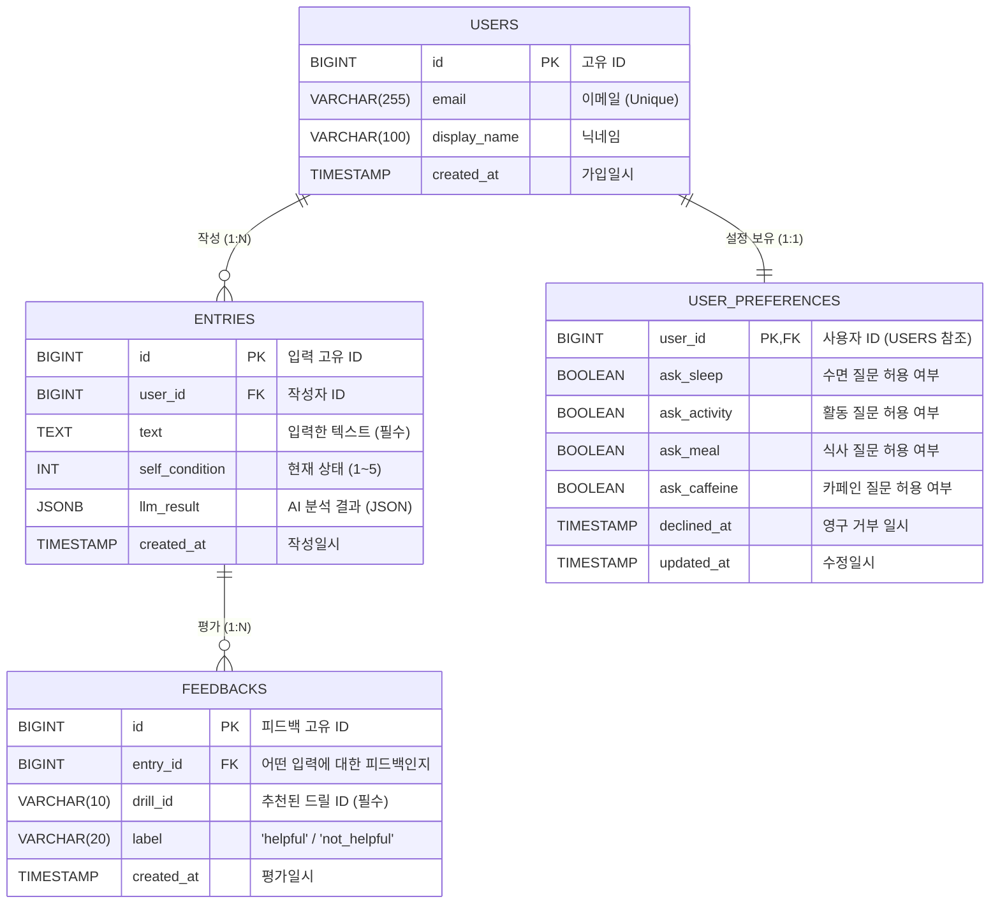

# 데이터베이스 ERD (Entity-Relationship Diagram)

프론트엔드 팀과 공유하기 위한 백엔드 데이터베이스 구조도 및 명세서입니다.

## 1. 시각화 다이어그램 (Mermaid)

아래 코드를 [Mermaid Live Editor](https://mermaid.live/) 에 붙여넣으시면 다이어그램 이미지로 변환해서 보실 수 있습니다. (노션 페이지에 `/mermaid` 블록을 생성하고 붙여넣으셔도 됩니다.)

## 2. 테이블 상세 설명

### 1) USERS (사용자 테이블)
- 서비스에 가입한 사용자의 기본 정보가 저장됩니다.

### 2) ENTRIES (입력 및 AI 분석 결과 테이블)
- 사용자가 한 줄 텍스트로 입력한 내용과, 그에 대해 LLM(AI)이 반환한 결과물이 저장됩니다.
- AI 응답 결과는 확장성을 위해 `JSONB` 타입으로 통째로 저장됩니다.

### 3) FEEDBACKS (드릴 추천 피드백 테이블)
- 시스템이 추천해 준 솔루션(드릴)에 대해 사용자가 '도움됨/도움 안 됨'으로 평가한 내역이 저장됩니다.

### 4) USER_PREFERENCES (사용자 질문 설정 테이블)
- 점진적 입력(추가 질문)에 대한 사용자별 on/off 설정이 저장됩니다. 
